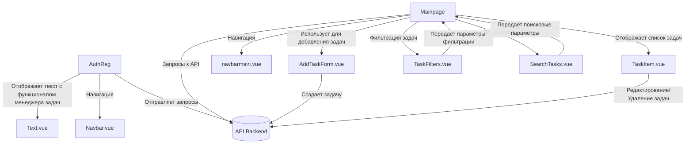

# Архитектура приложения

## Общее описание

Архитектура приложения разделена на фронтенд и бекенд. Фронтенд реализован на Vue 3 с использованием TypeScript и системы сборки Vite. Бекенд написан на Python с использованием фреймворка FastAPI и ORM SQLModel.
## Часть 1 - фронтенд

Реализован на Vue 3 с TypeScript. Отвечает за взаимодействие с пользователем, отправку запросов на сервер (бекенд) и отображение данных.
- Использует Vue Router для маршрутизации.
- Отправляет API-запросы к бекенду через HTTP (REST API).
- Выполняет обработку ответов и отображение данных.

### Структура проекта

```sh
frontend/
├── node_modules/        # Зависимости проекта
├── src/                 # Исходный код приложения
│   ├── assets/          # Статические файлы (изображения, иконки)
│   ├── components/      # Компоненты приложения
│   ├── router/          # Файлы маршрутизации (Vue Router)
│   ├── tests/           # Тесты
│   │   ├── moduletests/ # Модульные тесты
│   │   ├── UI/          # UI-тесты
│   │   └── tests/       # Юнит-тесты
│   ├── App.vue          # Главный компонент приложения
│   ├── style.css        # Стили для страниц
│   └── main.ts          # Точка входа приложения
├── index.html           # Шаблон HTML
├── package.json         # Список зависимостей и скриптов
├── tsconfig.json        # Конфигурация TypeScript
├── vite.config.ts       # Конфигурация Vite
└── vitest.config.ts     # Конфигурация Vitest для тестов
```

### Основные модули

`assets/` - Содержит статические ресурсы: изображения и иконки

- `components/` - Компоненты приложения.
	- `AddTaskForm.vue` – компонент добавления задачи.
	- `AuthReg.vue` - компонент авторизации/регистрации.
	- `Mainpage.vue` - основной компонент для работы с задачами.
	- `navbar.vue` - компонент шапки.
	- `navbarmain.vue` - основной компонент шапки.
    - `SearchTasks.vue` - компонент для поиска задач.
    - `TaskFilters.vue` - компонент для фильтрации задач.
    - `TaskItem.vue` - компонент для отображения списка задач.
    - `text.vue` - компонент с текстом описывающим функционал задачи.

`router/`:
- `index.ts` - описывает маршруты приложения с использованием Vue Router.

`tests/`:
- `moduletests/` - модульные тесты (реализованы на Vitest и jsdom).
- `UI/` - тесты пользовательских интерфейсов (с использованием Python, Selenium и Pytest)
- `tests/` - юнит-тесты, покрывающие логику компонентов и страниц. (реализованы на Vitest)

`App.vue` - Корневой компонент, содержащий базовый макет.

`main.ts` - Точка входа, где приложение инициализируется и монтируется.

Конфигурационные файлы:
- `tsconfig.json` - конфигурация TypeScript.
- `vite.config.ts` - настройки для сборки через Vite.
- `vitest.config.ts` - конфигурация для тестирования.

## Бэкенд

Реализован на FastAPI. Отвечает за обработку запросов от фронтенда и взаимодействие с базой данных.
- Маршруты API: /auth (авторизация), /tasks (управление задачами).
- Использует SQLModel для ORM (работа с базой данных).

## Структура проекта
```sh
backend/
├── py/                  
│   └──  database.py      # Код для настройки базы данных
├── main.py               # основной файл приложения, который содержит настройку приложения FastAPI, подключение роутеров и другие настройки, такие как CORS, документация и т. д. 
├── auth.py               # файл, содержащий логику аутентификации пользователей. Он должен содержать функции, связанные с авторизацией и созданием токенов (например, JWT), а также сам роутер для обработки запросов, связанных с пользователями (регистрация, логин и т. д.).
├── tasks.py              # файл, содержащий логику работы с задачами (например, создание, редактирование, удаление задач и т. д.). Этот файл должен содержать роутер, который будет обрабатывать запросы, связанные с задачами.
└── requirements.txt      # Зависимости проекта
```

### Основные модули

`main.py`:
- Инициализация приложения FastAPI.
- Настройка CORS (междоменные запросы).
- Подключение роутеров для обработки запросов (auth_router для авторизации и tasks_router для задач).
- Настройка документации OpenAPI и Swagger UI.
- Создание всех таблиц в базе данных через Base.metadata.create_all(bind=engine).

`database.py`:
- Task - Модель SQLAlchemy для задачи
- UserDB - Модель пользователя
- TaskResponse - Pydantic модель ответа задачи
- User - Pydantic модель для пользователя
- TaskCreate - Pydantic модель для создания задачи

`tasks.py`:
- get_tasks(...) - получение задач определенного пользователя
- create_task(...) - создает задачу для определенного пользователя
- update_task(...) - обновление задачи
- task_delete(...) - удаление задачи определенного пользователя

`auth.py`:
- register_new_user(...) - регистрация нового пользователя
- login_user(...) - авторизация пользователя

`requirements.txt` - список всех зависимостей, использующихся в серверном скрипте

### Документация

В проекте доступна автоматически сгенерированная интерактивная документация API, основанная на стандарте OpenAPI.

- Swagger UI: Документация доступна по адресу /docs, где можно увидеть и протестировать все доступные маршруты API.
- OpenAPI JSON: Спецификация OpenAPI в формате JSON доступна по адресу /openapi.json.

# Инструкция по развертыванию проекта

Для развертывания проекта используется Dockerfile. С помощью него создается Docker образ.

На сервер клонируется репозиторий с помощью команды:
```sh
git clone https://gitverse.ru/rupollya/vue_vite_ts.git
```

Переход в папку проекта:
```sh
cd vue_vite_ts
```

Затем собираем образ:
```sh
docker build -t <название образа> .
```

И запускаем контейнер из образа:
```sh
docker run -d -p 8080:80 <название образа>
```

После успешного запуска контейнера проект должен быть доступен по адресу http://IP, где IP - IP вашего сервера.

# Схема взаимодействия компонентов веб-приложения



# Поток данных между компонентами

## Регистрация

- Пользователь отправляет данные для регистрации (логин и пароль) через axios.post('/api/auth/registration', newUser).
- В случае успешной регистрации сохраняется JWT токен в cookies, и пользователю показывается сообщение о успешной регистрации.

## Авторизация

- AuthReg.vue отправляет данные для входа/регистрации через axios.
- При успешной авторизации получает JWT-токен и сохраняет его в Cookies.
- После авторизации перенаправляет на маршрут /base.

## Основная страница

- Загрузка задач:
	- При монтировании компонента автоматически отправляется GET запрос через axios на API для получения списка задач текущего пользователя.
	- Ответ от сервера, содержащий данные о задачах, сохраняется в переменной tasks.
	- Полученные задачи используются для отображения списка задач на основной странице через компонент TaskItem.vue, который отображает каждую задачу по отдельности.
- Отображение задач:
	- Компонент TaskItem.vue получает данные о каждой задаче (например, название, дедлайн, статус) из родительского компонента через props.
- Добавление задачи:
	- Компонент AddTaskForm.vue передает данные о новой задаче в родительский компонент, который отправляет их через axios.post('/api/tasks/task/create', task) на сервер.
	- После успешного добавления задачи в базу данных, сервер возвращает созданную задачу, которая добавляется в массив tasks в родительском компоненте.
	- Обновленный массив задач отображается на странице с помощью компонента TaskItem.vue.
- Фильтрация задач:
	- Когда пользователь выбирает фильтр задач, компонент обновляет состояние переменной currentFilter, которая определяет, какие задачи должны быть показаны (все, завершенные или незавершенные).
	- После изменения фильтра, задачи пересчитываются с учетом текущего фильтра и строки поиска. Это обновляет отображаемые задачи без необходимости отправки нового запроса на сервер.
	- Результаты фильтрации отображаются пользователю, а фильтр сохраняется в компоненте.
- Поиск задач:
	- Строка поиска, введенная пользователем, сохраняется в переменной searchQuery.
	- Отображаемые задачи обновляются в соответствии с строкой поиска, и компонент TaskItem.vue отвечает за отображение этих данных.
- Редактирование задачи:
	- При открытии модального окна редактирования, компонент передает данные о задаче в форму редактирования. Пользователь может внести изменения, и при сохранении компонент отправляет запрос PUT на сервер с обновленными данными.
	- После успешного обновления задачи на сервере, компонент получает обновленные данные и синхронизирует их с массивом tasks.
	- После редактирования задача обновляется в списке, и изменения отображаются на странице.
- Удаление задачи:
	- При удалении задачи компонент отправляет запрос DELETE на сервер с идентификатором удаляемой задачи.
	- После успешного удаления задачи, компонент удаляет задачу из массива tasks, что обновляет список задач на странице.

# Поток данных на примере(регистрация, авторизация, получение задач, создание задачи)

## Регистрация
- Пользователь заполняет форму регистрации на фронтенде.
- Фронтенд отправляет POST-запрос на /api/auth/register с данными: {"username": "user", "password": "123qQ!"}.
- Бекенд:
	- Проверяет уникальность имени пользователя.
	- Сохраняет пользователя в базе данных.

## Авторизация
- Пользователь вводит данные для входа на фронтенде.
- Фронтенд отправляет POST-запрос на /api/auth/login с данными: {"username": "user", "password": "123qQ!"}.
- Бекенд:
	- Проверяет данные пользователя в базе.
	- Возвращает JWT-токен при успешной авторизации.

## Получение задач
- Фронтенд запрашивает список задач с помощью GET-запроса на /api/tasks.
- Бекенд проверяет токен авторизации пользователя.
- Получает задачи пользователя из базы данных.
- Возвращает JSON с данными.

## Создание задачи
- Пользователь заполняет форму создания задачи на фронтенде.
- Фронтенд отправляет POST-запрос на /api/tasks/task/create с данными.
- Бекенд проверяет токен авторизации пользователя.
- Cохраняет задачу в базе данных.
# vue_project
